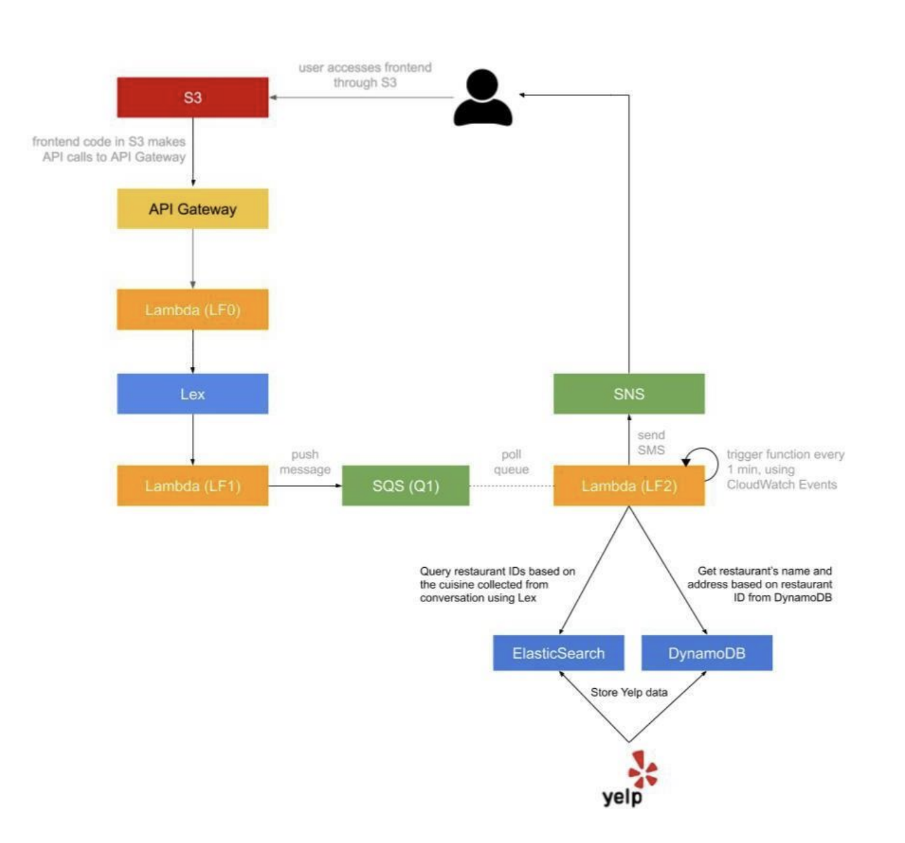

# CloudComputingAssignment1

Customer Service is a core service for a lot of businesses around the world and it is getting
disrupted at the moment by Natural Language Processing-powered applications.

In this project I implemented a serverless, microservice-driven web application. Specifically, I built a Dining Concierge chatbot 
that sends the restaurant suggestions given a set of preferences that user provides the chatbot with through conversation.

